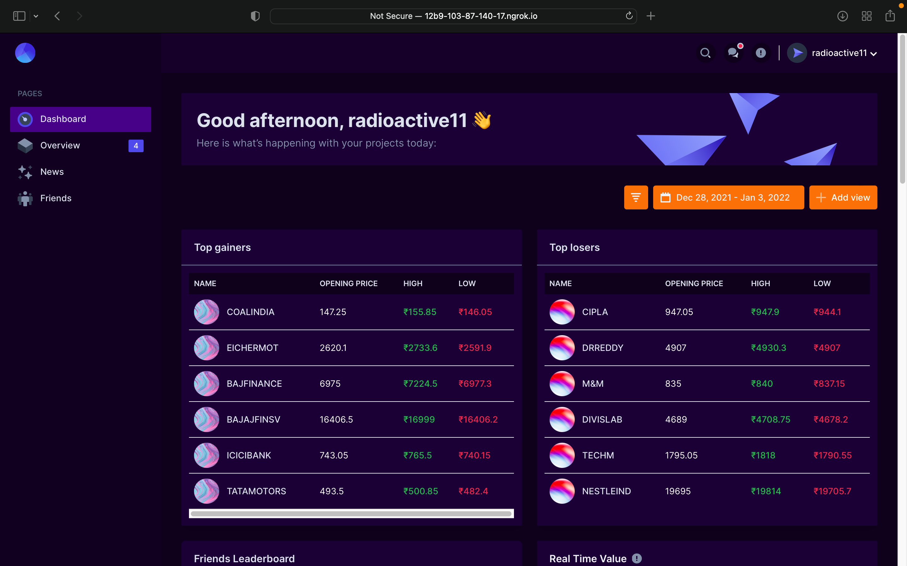
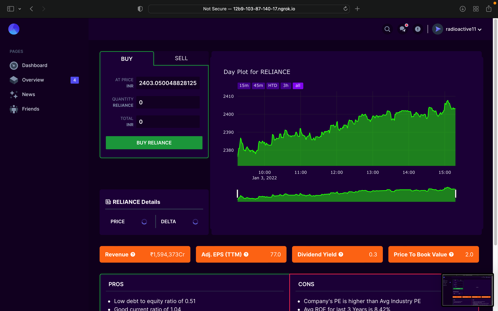
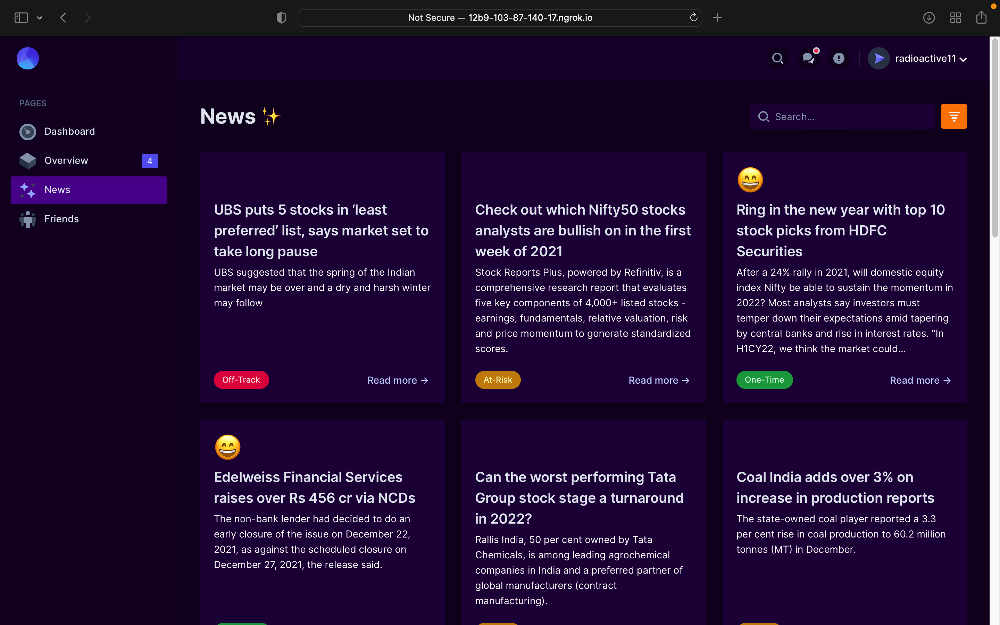
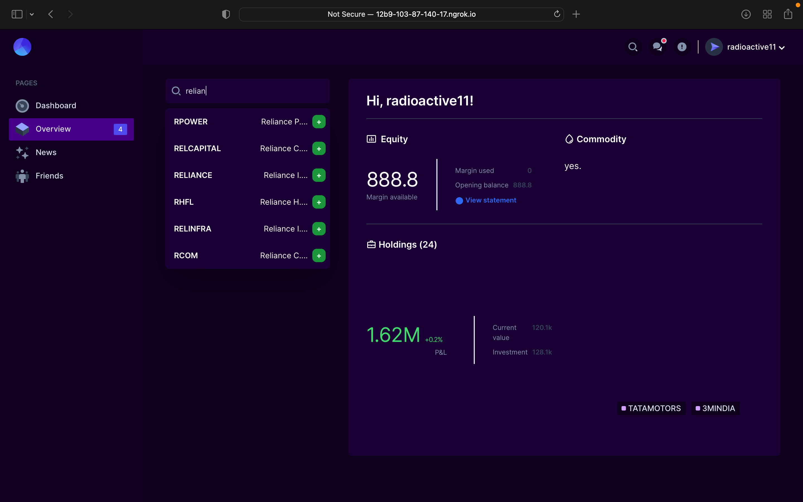

<p align="center">

[](https://forthebadge.com)
[](https://forthebadge.com)
[](https://forthebadge.com)


</p>

<!-- PROJECT LOGO -->
<br/>
<p align="center">
  <a href="https://rezonanceindia.tech/">
    
  </a>

  <h1 align="center">Starlight</h1>
  <p align="center">
    India's First Gamified Virtual Trading Platform
    <br />
    <a href="https://aqua-client.vercel.app/h"><strong>Visit the website »</strong></a>
    <br />
    <br />
    <a href="https://aqua-client.vercel.app/">View Demo</a>
    ·
    <a href="https://github.com/0xCompyler/starlight-pisces/issues">Report Bug</a>
    ·
    <a href="https://github.com/0xCompyler/starlight-pisces/issues">Request Feature</a>
  </p>
</p>

</p>


<!-- TABLE OF CONTENTS -->
## Table of Contents

* [About the Project](#about-the-project)
  * [Real-time Interactive Graphs](#real-time-interactive-graphs)
  * [Stock metrics](#stock-metrics)
  * [Pros & Cons](#pros-&-cons)
  * [Compete with friends](#compete-with-friends)
  * [Interactive Portfolio](#interactive-portfolio)

* [Getting Started](#getting-started)
  * [Prerequisites](#prerequisites)
  * [Installation](#installation)
* [Product Screenshots](#Product-Screenshots)
* [Roadmap](#roadmap)
* [Contributing](#contributing)
* [Contact](#contact)


<!-- ABOUT THE PROJECT -->
## About The Project

[![Product Name Screen Shot][product-screenshot]

Starlight is a gamified virtual trading platform where traders can learn about stock trading, analyze their decisions and compete with their friends without the fear of losing actual money. 

These are the features that we currently provide. 
<br/>

:chart_with_upwards_trend: Real-time stock prices (60 second delay)

:nerd_face: Stock metrics

:yin_yang: Individual stock pros & cons 

:family_woman_woman_boy_boy: Compete with friends

:1st_place_medal: Climb the leaderboard

:ledger: Interaactive Portfolio

:newspaper: Financial news with sentiment scores

:mag: Auto Complete & Auto Correct Search


<br />

### Real-time Interactive Graphs
We provide real-time interactive plots for prices which makes analyzing trends easier and hasslefree.

### Stock metrics
Learn about metrics like Market Capitalization, Price to Book Ratio, Dividend Yield and much more

<br />

### Pros & Cons
Get to know why investing in a stock might be a good/bad idea

<br />

### Compete with friends
Compete with your friends and rule the leaderboard

<br />

### Interactive Portfolio
Keep a track of your trades, best & worst decisions

<br />
<br />

## Built With

</br>
<p float = "left">


</p>


<!-- GETTING STARTED -->
## Getting Started

To get a local copy up and running follow these simple example steps.

### Prerequisites


* Python 3.8+
* FastAPI
* PostgreSQL
* Docker
* Redis


### Installation 

<br />

### Fast API
<br />

1. Clone the repo 
```sh
git clone https://github.com/rezonance-india/engine-api
```


2. Create a Python 3 virtual environment (inside ai directory)
```sh
cd engine-api
python3 -m venv venv
source venv/bin/activate
```

3. Install requirements
```sh
pip install -r requirements.txt
```

4. Export Python Path
```sh
export PYTHONPATH=src
```

5. Start Redis Server
```sh
redis-server /usr/local/etc/redis.conf
```

</br>
6. Start Uvicorn server

```sh
uvicorn src.main:app
```

<br />


<!-- USAGE EXAMPLES -->
## Flowchart


## Product Screenshots










<!-- ROADMAP -->
## Roadmap

See the [open issues](https://github.com/rezonance-india/engine-api/issues) for a list of proposed features (and known issues).


<!-- CONTRIBUTING -->
## Contributing

Contributions are what make the open source community such an amazing place to be learn, inspire, and create. Any contributions you make are **greatly appreciated**.

1. Fork the Project
2. Create your Feature Branch (`git checkout -b feature/AmazingFeature`)
3. Commit your Changes (`git commit -m 'Add some AmazingFeature'`)
4. Push to the Branch (`git push origin feature/AmazingFeature`)
5. Open a Pull Request


<!-- CONTACT -->
## Contact

Arijit Roy - [GitHub](https://github.com/radioactive11) - roy.arijit2001@gmail.com

Kartik Goel - [GitHub](https://github.com/kg-kartik) - goel.kartik39@gmail.com

Boidushya Bhattacharaya - [GitHub](https://github.com/boidushya) - boidushyabhattacharya@gmail.com


[product-screenshot]: STATIC/landing.png